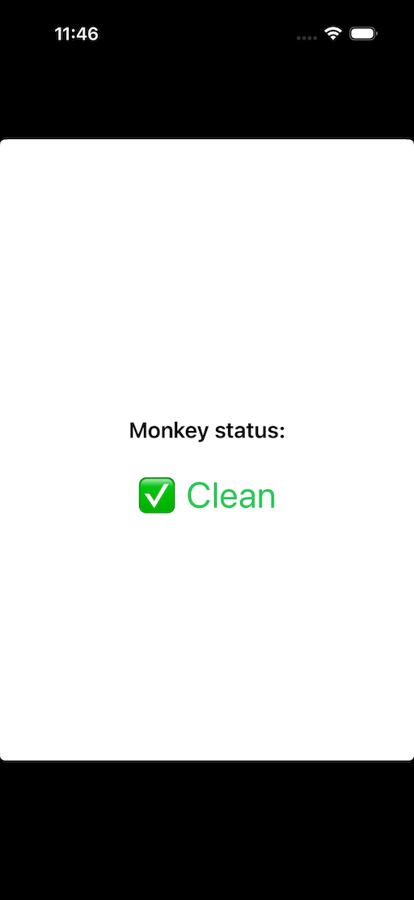
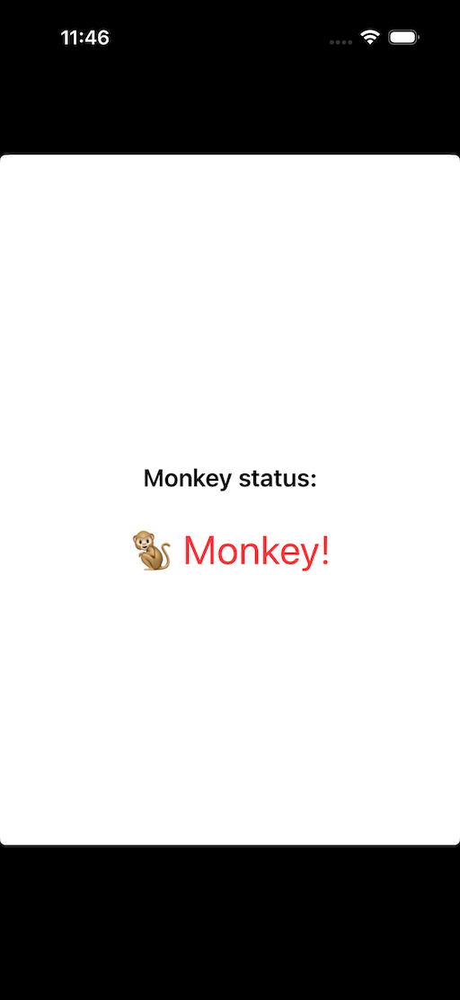

# Jailbreak Detector (X04)

A lightweight Swift extension for `UIDevice` that checks for common jailbreak indicators.

## Status

Legacy reference. Modern iOS integrity checks rely on App Attest (and DeviceCheck), so this heuristic approach is far less relevant today.

## Features

- URL scheme checks, file presence scans, and a write test.
- Configurable jailbreak scheme via `X0R_KEY` in your Info.plist/XCConfig.
- Simple `UIDevice` API: `x04` (jailbroken) and `x102` (simulator).

## Installation

Use Swift Package Manager (Xcode: File → Add Packages...) with:

```
https://github.com/deya-eldeen/JailbreakDetector.git
```

Or add `Sources/X04Checker/X04.swift` to your project.

## Usage

```swift
if UIDevice.current.x04 {
    // Device appears jailbroken—take action (disable features, alert user, etc.)
}
```

SwiftUI sample:

```swift
import SwiftUI
import X04Checker

struct ContentView: View {
    @State private var monkey = false
    @State private var showAlert = false

    var body: some View {
        VStack(spacing: 20) {
            Text("Monkey status:")
                .font(.headline)

            Text(monkey ? "🐒 Monkey!" : "✅ Clean")
                .font(.title)
                .foregroundColor(monkey ? .red : .green)
        }
        .padding()
        .onAppear {
            monkey = UIDevice.current.x04
            showAlert = monkey
        }
        .alert("Warning", isPresented: $showAlert) {
            Button("OK", role: .cancel) { }
        } message: {
            Text("Your device appears to have a monkey. Certain features may be disabled.")
        }
    }
}
```

## Example App

A sample iOS app lives at `Example/ExampleApp.xcodeproj` and uses the package directly.

## Screenshots

| Clean | Affected |
| --- | --- |
|  |  |

## How It Works

`JailbreakDetector` runs three checks:

1. URL scheme: `UIApplication.shared.canOpenURL(URL(string: "<scheme>://"))`.
2. File checks: scans a list of suspicious paths.
3. Write test: attempts to write outside the sandbox (e.g. `/private/monkey_write_test`).

Simulator always returns `false` for `x04` to avoid development false positives.

## Customization

- Add paths in `JailbreakDetector.suspiciousPaths` (`Sources/X04Checker/X04.swift`).
- Change the default scheme (`"cydia"`) or inject `X0R_KEY` via XCConfig.
- Add logging/metrics around each check if needed.

## Build

This package targets iOS and uses `UIKit`, so build it with Xcode or `xcodebuild` for an iOS destination.

Xcode:
- Open `Package.swift`
- Select an iOS Simulator destination
- Build (⌘B)

CLI:
```bash
xcodebuild -scheme X04Checker -destination 'platform=iOS Simulator,name=iPhone 14' -sdk iphonesimulator build
```

## Tests

Run tests on an iOS Simulator (UIKit is not available on macOS targets).

Xcode:
- Open `Package.swift`
- Select an iOS Simulator destination
- Test (⌘U)

CLI:
```bash
xcodebuild -scheme X04Checker -destination 'platform=iOS Simulator,name=iPhone 16,OS=18.6' -sdk iphonesimulator test
```

## Optional Obfuscation

Generate an obfuscated copy while keeping a readable source for maintenance:

```bash
python3 scripts/obfuscate.py Sources/X04Checker/X04.swift --out dist/X04.swift
```

Notes:
- Public/open identifiers are preserved automatically.
- Add extra preserved identifiers with `--preserve name1,name2`.
- This is a best-effort token replacer and does not change string contents or comments (interpolation expressions are updated).
- Replace the Swift file you embed in your app with the obfuscated output.

## Credits

- Original concept by **Vineet Choudhary**.
- Article: [Best Way to Check if Your iOS App Is Running on a Jailbroken Phone](https://developerinsider.co/best-way-to-check-if-your-ios-app-is-running-on-a-jailbroken-phone/)

---

Security disclaimer: No jailbreak detection is foolproof. Always combine detection with server-side safeguards and integrity checks.
